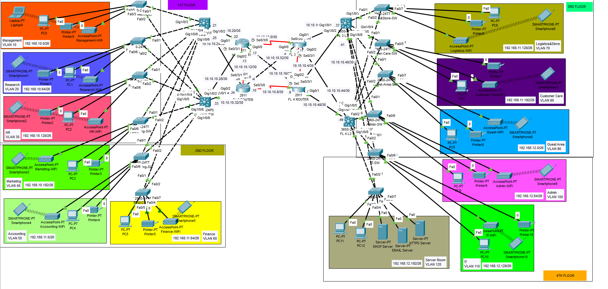

# Project #2: Multi-Floor Enterprise Network

---

## 1 - Objectives and Requirements

A multi-floor enterprise network is required to support various departments across four floors, integrating data, voice, and wireless services with dedicated VLANs. The network must ensure connectivity and access to internal servers.

### Requirements:

a. Create a network topology with the main components to support the following:

- 1st Floor: Management VLAN 10, Research VLAN 20, Marketing VLAN 30.
- 2nd Floor: Finance VLAN 50.
- 3rd Floor: Logistics & Store VLAN 70, Customer Care VLAN 80.
- 4th Floor: Guest Area VLAN 90, Admin VLAN 100 with DHCP, Email, and Web servers.b. Configure core devices for end-to-end connectivity and access to internal servers.
- Each department/floor must have a separate IP network with VLANs.
- Switches should be configured with VLANs and security settings.
- Use RIPv2 for internal routing and static routing for server access.
- Devices in departments should acquire dynamic IP addresses via DHCP where applicable.

### Tasks:

**Task 1**: Plan, design, and prototype the network topology using Cisco Packet Tracer.

**Task 2**: Configure the network with appropriate settings for connectivity and functionality.

---

## 2 - Steps of Solution

1. Design the network topology based on the provided diagram.
2. Power on the router and switches across all floors.
3. Assign clock rates on serial interfaces (e.g., Se0/0, Se0/1).
4. Configure switches with VLANs (10, 20, 30, 50, 70, 80, 90, 100) and IP addresses.
5. Assign IP addresses to all subnetworks and end devices.
6. Configure DHCP for dynamic IP assignment on department networks.
7. Implement RIPv2 for internal routing and static routes for servers.

---

## 3 - The Design



---

## 4 - The Configuration

### Router

```bash
en
conf t
interface gig0/0
 no shutdown
interface se0/0
 no shutdown
 clock rate 64000
 ip address 10.10.0.1 255.255.255.252
interface gig0/0.10
 encapsulation dot1Q 10
 ip address 192.168.10.1 255.255.255.0
interface gig0/0.20
 encapsulation dot1Q 20
 ip address 192.168.20.1 255.255.255.0
interface gig0/0.30
 encapsulation dot1Q 30
 ip address 192.168.30.1 255.255.255.0
interface gig0/0.50
 encapsulation dot1Q 50
 ip address 192.168.50.1 255.255.255.0
interface gig0/0.70
 encapsulation dot1Q 70
 ip address 192.168.70.1 255.255.255.0
interface gig0/0.80
 encapsulation dot1Q 80
 ip address 192.168.80.1 255.255.255.0
interface gig0/0.90
 encapsulation dot1Q 90
 ip address 192.168.90.1 255.255.255.0
interface gig0/0.100
 encapsulation dot1Q 100
 ip address 192.168.100.1 255.255.255.0
ip dhcp pool admin-pool
 network 192.168.100.0 255.255.255.0
 default-router 192.168.100.1
 dns-server 192.168.100.3
service dhcp
router rip
 version 2
 network 10.10.0.0
 network 192.168.10.0
 network 192.168.20.0
 network 192.168.30.0
 network 192.168.50.0
 network 192.168.70.0
 network 192.168.80.0
 network 192.168.90.0
 network 192.168.100.0

```

### Switch (1st Floor - Management VLAN 10)

```bash
en
conf t
interface range fa0/1-5
 switchport mode access
 switchport access vlan 10
interface vlan 10
 ip address 192.168.10.2 255.255.255.0
 no shutdown

```

### Switch (1st Floor - Research VLAN 20)

```bash
en
conf t
interface range fa0/6-10
 switchport mode access
 switchport access vlan 20
interface vlan 20
 ip address 192.168.20.2 255.255.255.0
 no shutdown

```

### Switch (1st Floor - Marketing VLAN 30)

```bash
en
conf t
interface range fa0/11-15
 switchport mode access
 switchport access vlan 30
interface vlan 30
 ip address 192.168.30.2 255.255.255.0
 no shutdown

```

### Switch (2nd Floor - Finance VLAN 50)

```bash
en
conf t
interface range fa0/1-5
 switchport mode access
 switchport access vlan 50
interface vlan 50
 ip address 192.168.50.2 255.255.255.0
 no shutdown

```

### Switch (3rd Floor - Logistics VLAN 70)

```bash
en
conf t
interface range fa0/1-5
 switchport mode access
 switchport access vlan 70
interface vlan 70
 ip address 192.168.70.2 255.255.255.0
 no shutdown

```

### Switch (3rd Floor - Customer Care VLAN 80)

```bash
en
conf t
interface range fa0/6-10
 switchport mode access
 switchport access vlan 80
interface vlan 80
 ip address 192.168.80.2 255.255.255.0
 no shutdown

```

### Switch (4th Floor - Guest Area VLAN 90)

```bash
en
conf t
interface range fa0/1-5
 switchport mode access
 switchport access vlan 90
interface vlan 90
 ip address 192.168.90.2 255.255.255.0
 no shutdown

```

### Switch (4th Floor - Admin VLAN 100)

```bash
en
conf t
interface range fa0/6-10
 switchport mode access
 switchport access vlan 100
interface vlan 100
 ip address 192.168.100.2 255.255.255.0
 no shutdown

```
