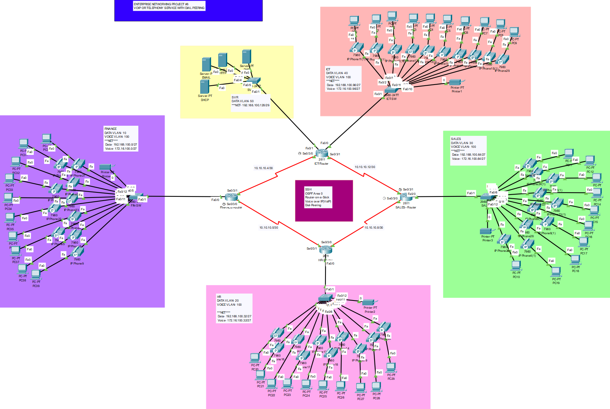

# Project #4: Enterprise Networking with VoIP and Data VLANs

---

## 1 - Objectives and Requirements

An enterprise network is required to support multiple departments (Finance, HR, Sales) with separate data and voice services across VLANs. The network must integrate VoIP telephony and provide access to internal servers.

### Requirements:

a. Create a network topology with the main components to support the following:

- Finance VLAN 10: PCs and IP Phones for finance staff.
- HR VLAN 20: PCs and IP Phones for HR staff.
- Sales VLAN 30: PCs, IP Phones, and printers for sales team.
- Data VLAN 40: Hosts DMZ Server and FTP Server.
- Voice VLAN 100: Supports VoIP services across all departments.
- CTR Router connects all VLANs with HR Router and Sales Router.b. Configure core devices for end-to-end connectivity and access to internal servers.
- Each department must have a separate IP network with VLANs.
- Switches should be configured with VLANs, including voice VLANs and security settings.
- Use RIPv2 for internal routing and static routing for server access.
- Devices in departments should acquire dynamic IP addresses via DHCP where applicable.

### Tasks:

**Task 1**: Plan, design, and prototype the network topology using Cisco Packet Tracer.

**Task 2**: Configure the network with appropriate settings for connectivity and VoIP functionality.

---

## 2 - Steps of Solution

1. Design the network topology based on the provided diagram.
2. Power on routers (CTR Router, HR Router, Sales Router) and switches.
3. Assign clock rates on serial interfaces (e.g., Se0/0, Se0/1).
4. Configure switches with VLANs (10, 20, 30, 40, 100) and IP addresses.
5. Assign IP addresses to all routers, subnetworks, and end devices.
6. Configure DHCP for dynamic IP assignment on department networks.
7. Implement RIPv2 for internal routing and static routes for servers.

---

## 3 - The Design



---

## 4 - The Configuration

### CTR Router

```bash
en
conf t
interface fa0/0
 no shutdown
interface se0/0
 no shutdown
 clock rate 64000
 ip address 10.10.0.1 255.255.255.252
interface se0/1
 no shutdown
 ip address 10.10.0.5 255.255.255.252
interface vlan 10
 ip address 172.16.10.1 255.255.255.224
interface vlan 40
 ip address 172.16.40.1 255.255.255.224
ip dhcp pool finance-pool
 network 172.16.10.0 255.255.255.224
 default-router 172.16.10.1
 dns-server 172.16.40.1
ip dhcp pool data-pool
 network 172.16.40.0 255.255.255.224
 default-router 172.16.40.1
 dns-server 172.16.40.1
service dhcp
router rip
 version 2
 network 10.10.0.0
 network 172.16.10.0
 network 172.16.40.0

```

### HR Router

```bash
en
conf t
interface fa0/0
 no shutdown
interface se0/0
 no shutdown
 ip address 10.10.0.2 255.255.255.252
interface vlan 20
 ip address 172.16.20.1 255.255.255.224
ip dhcp pool hr-pool
 network 172.16.20.0 255.255.255.224
 default-router 172.16.20.1
 dns-server 172.16.40.1
service dhcp
router rip
 version 2
 network 10.10.0.0
 network 172.16.20.0

```

### Sales Router

```bash
en
conf t
interface fa0/0
 no shutdown
interface se0/0
 no shutdown
 ip address 10.10.0.6 255.255.255.252
interface vlan 30
 ip address 172.16.30.1 255.255.255.224
ip dhcp pool sales-pool
 network 172.16.30.0 255.255.255.224
 default-router 172.16.30.1
 dns-server 172.16.40.1
service dhcp
router rip
 version 2
 network 10.10.0.0
 network 172.16.30.0

```

### Switch (Finance VLAN 10)

```bash
en
conf t
interface range fa0/1-10
 switchport mode access
 switchport access vlan 10
interface range fa0/11-20
 switchport mode voice
 switchport voice vlan 100
interface vlan 10
 ip address 172.16.10.2 255.255.255.224
 no shutdown

```

### Switch (HR VLAN 20)

```bash
en
conf t
interface range fa0/1-10
 switchport mode access
 switchport access vlan 20
interface range fa0/11-20
 switchport mode voice
 switchport voice vlan 100
interface vlan 20
 ip address 172.16.20.2 255.255.255.224
 no shutdown

```

### Switch (Sales VLAN 30)

```bash
en
conf t
interface range fa0/1-10
 switchport mode access
 switchport access vlan 30
interface range fa0/11-20
 switchport mode voice
 switchport voice vlan 100
interface vlan 30
 ip address 172.16.30.2 255.255.255.224
 no shutdown

```

### Switch (Data VLAN 40)

```bash
en
conf t
interface range fa0/1-5
 switchport mode access
 switchport access vlan 40
interface vlan 40
 ip address 172.16.40.2 255.255.255.224
 no shutdown

```
