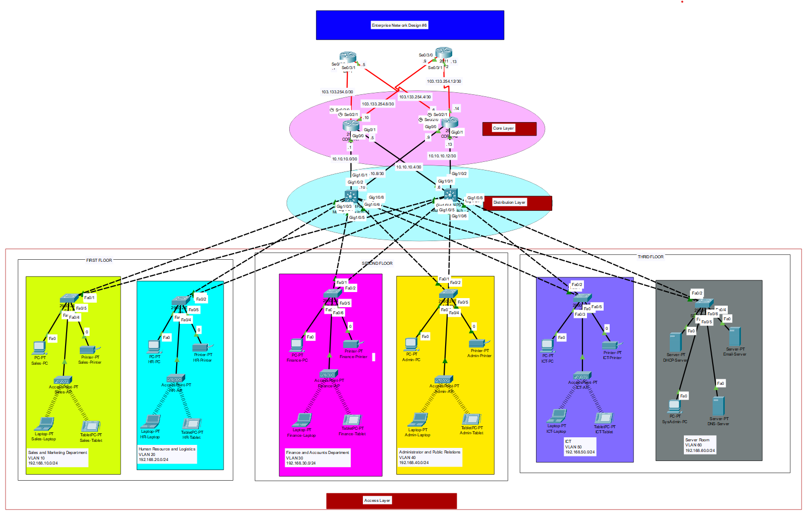

# Project #5: Multi-Layer Enterprise Network

---

## 1 - Objectives and Requirements

A multi-layer enterprise network is required to support various departments across three floors, utilizing Core, Distribution, and Access layers for robust connectivity. The network must integrate data services and provide access to internal servers.

### Requirements:

a. Create a network topology with the main components to support the following:

- 1st Floor: Sales and Marketing Department VLAN 10, Human Resource and Logistics VLAN 20.
- 2nd Floor: Finance and Accounts Department VLAN 30, Administrator and Public Relations VLAN 40.
- 3rd Floor: IT VLAN 60 with DHCP Server, Email Server, SysAdmin Server, and DNS Server.b. Configure core devices for end-to-end connectivity and access to internal servers.
- Each department/floor must have a separate IP network with VLANs.
- Switches should be configured with VLANs and security settings.
- Use RIPv2 for internal routing and static routing for server access.
- Devices in departments should acquire dynamic IP addresses via DHCP where applicable.

### Tasks:

**Task 1**: Plan, design, and prototype the network topology using Cisco Packet Tracer.

**Task 2**: Configure the network with appropriate settings for connectivity and functionality.

---

## 2 - Steps of Solution

1. Design the network topology based on the provided diagram.
2. Power on routers (2911) and switches across all layers.
3. Assign clock rates on serial interfaces (e.g., Se0/0, Se0/1).
4. Configure switches with VLANs (10, 20, 30, 40, 60, 70, 80) and IP addresses.
5. Assign IP addresses to all subnetworks and end devices.
6. Configure DHCP for dynamic IP assignment on department networks.
7. Implement RIPv2 for internal routing and static routes for servers.

---

## 3 - The Design



---

## 4 - The Configuration

### Router (2911 - Core Layer)

```bash
en
conf t
interface gig0/0
 no shutdown
interface se0/0
 no shutdown
 clock rate 64000
 ip address 10.10.0.1 255.255.255.252
interface se0/1
 no shutdown
 ip address 10.10.12.1 255.255.255.252
interface gig0/0.10
 encapsulation dot1Q 10
 ip address 192.168.10.1 255.255.255.0
interface gig0/0.20
 encapsulation dot1Q 20
 ip address 192.168.20.1 255.255.255.0
interface gig0/0.30
 encapsulation dot1Q 30
 ip address 192.168.30.1 255.255.255.0
interface gig0/0.40
 encapsulation dot1Q 40
 ip address 192.168.40.1 255.255.255.0
interface gig0/0.60
 encapsulation dot1Q 60
 ip address 192.168.60.1 255.255.255.0
ip dhcp pool it-pool
 network 192.168.60.0 255.255.255.0
 default-router 192.168.60.1
 dns-server 192.168.60.5
service dhcp
router rip
 version 2
 network 10.10.0.0
 network 10.10.12.0
 network 192.168.10.0
 network 192.168.20.0
 network 192.168.30.0
 network 192.168.40.0
 network 192.168.60.0

```

### Switch (1st Floor - Sales and Marketing VLAN 10)

```bash
en
conf t
interface range fa0/1-5
 switchport mode access
 switchport access vlan 10
interface vlan 10
 ip address 192.168.10.2 255.255.255.0
 no shutdown

```

### Switch (1st Floor - HR and Logistics VLAN 20)

```bash
en
conf t
interface range fa0/6-10
 switchport mode access
 switchport access vlan 20
interface vlan 20
 ip address 192.168.20.2 255.255.255.0
 no shutdown

```

### Switch (2nd Floor - Finance and Accounts VLAN 30)

```bash
en
conf t
interface range fa0/1-5
 switchport mode access
 switchport access vlan 30
interface vlan 30
 ip address 192.168.30.2 255.255.255.0
 no shutdown

```

### Switch (2nd Floor - Admin and PR VLAN 40)

```bash
en
conf t
interface range fa0/6-10
 switchport mode access
 switchport access vlan 40
interface vlan 40
 ip address 192.168.40.2 255.255.255.0
 no shutdown

```

### Switch (3rd Floor - IT VLAN 60)

```bash
en
conf t
interface range fa0/1-5
 switchport mode access
 switchport access vlan 60
interface vlan 60
 ip address 192.168.60.2 255.255.255.0
 no shutdown

```
